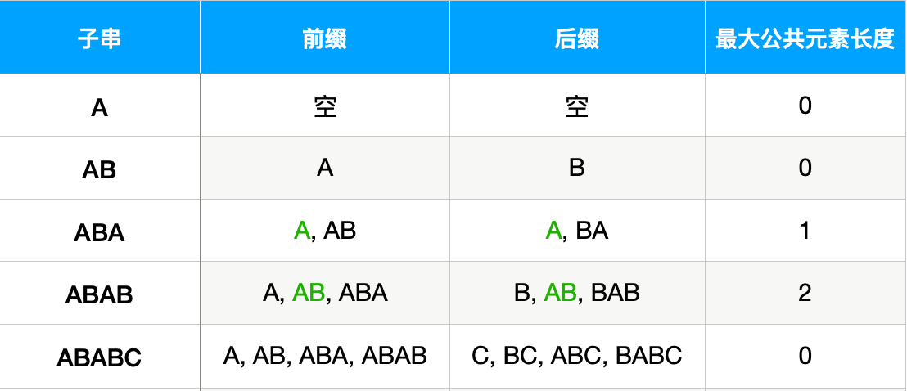
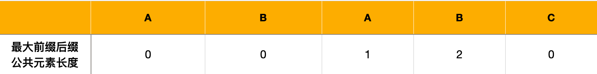
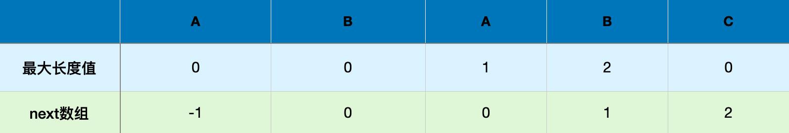
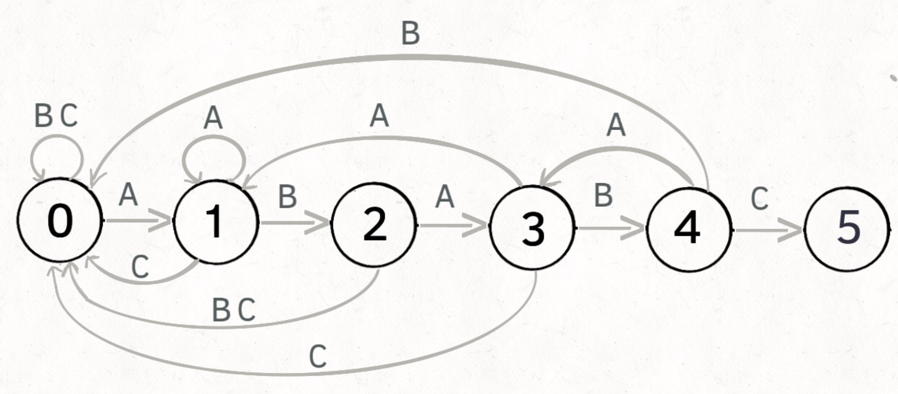

## 状态机

- 每一种状态都是一个机器
- 每个步骤都会确定下一个状态
- 在每一个状态里都可以填入相应的逻辑处理
- 固定的下一个状态：moore
- 根据下一个字符确定下一个状态：mealy

### KMP

> Knuth-Morris-Pratt 字符串查找算法，简称为 “KMP算法”，常用于在一个文本串S内查找一个模式串P 的出现位置，这个算法由Donald Knuth、Vaughan Pratt、James H. Morris三人于1977年联合发表，故取这3人的姓氏命名此算法


KMP中有一个**特点**，文本串`S`的索引会不断**向前推进**或*停止*，但**永远**不会**往后移动**，只需要通过不断移动模式串`P`的位置即可完成匹配，极大的缩减了查找时间

#### 匹配过程

假设现在文本串`S`匹配到`i`位置，模式串`P`匹配到`j`位置

- 如果`j=-1`或`S[i]==P[j]`，则`i++`（即向前推进）、`j++`，继续匹配下一个字符
- 如果`j!=-1`或`S[i]!=P[j]`，则`i不变`（即停止），`j=next[j]`。意味着匹配失败时，模式串`P`相对于文本串`S`向右移动了`j - next[j] `位。

#### 最大长度表

例子：模式串`P`为`ABABC`

寻找最大相同前缀后缀元素，从左往右遍历



则得到 原模式串子串对应的各个前缀后缀的公共元素的「**最大长度表**」为



根据该表得出，匹配失败时，模式串`P`向右移动的位数为：**已匹配字符数 - 匹配失败字符的上一位字符所对应的最大长度值**

```
       i
S: ABABDABABC
P: ABABC
       j
      j匹配到C这个位置时，发现D与C不同，匹配失败
      此时 i=4  j=4
      匹配失败时，则i不变，j=[最大长度表][j - 1]，即j=2
      [最大长度表]=[0,0,1,2,0]

根据失配时移动的公式
已匹配字符数(4) - 匹配失败字符的上一位字符所对应的最大长度值(2)

===> 向右移动2位

       i
S: ABABDABABC
P:   ABABC
       j
      此时 i=4  j=2
      发现A与C也不同，匹配失败 
      i不变，j=[最大长度表][j - 1]，即j=0
      向右移动 2位（2-0）

       i
S: ABABDABABC
P:     ABABC
       j
      此时 i=4  j=0
      因为起始位置A匹配失败，则自动向前移动一位

        i
S: ABABDABABC
P:      ABABC
        j     
      此时 i=4  j=0
      匹配成功，返回位置i-j+1
```

#### next数组

`next`数组相当于「最大长度值」 整体向右移动一位，然后初始值赋为`-1`



那`next`数组，匹配失败时，模式串向右移动的位数 = **失配字符的位置 - 失配字符对应的`next值`**
  - 其中，从0开始计数时，失配字符的位置 = 已经匹配的字符数（失配字符不计数），而失配字符对应的next 值 = 失配字符的上一位字符的最大长度值，所以next数组和最大长度表比较，结果必然完全一致。


### next数组与有限状态机

根据下一个字符的情况，状态向前或向后移动



## HTTP