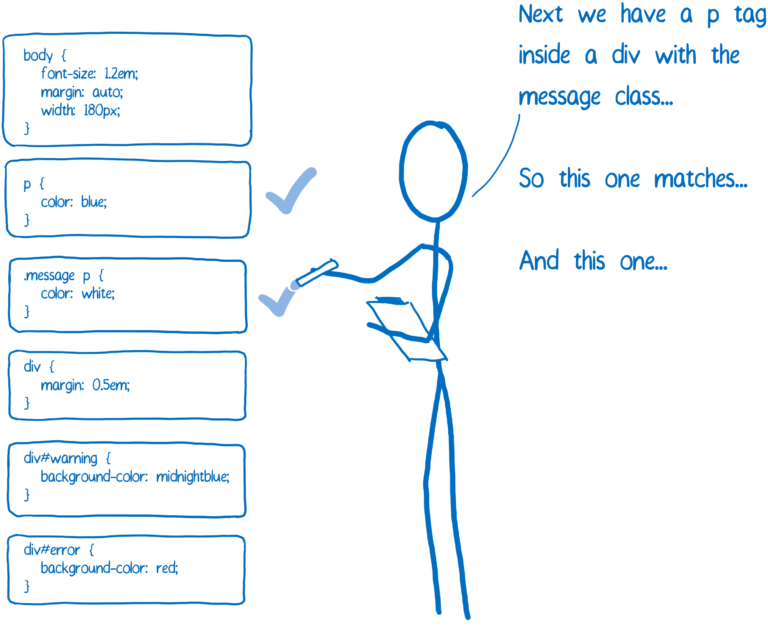

### 思考题

” 为什么 first-letter 可以设置 float 之类的，而 first-line 不行呢？“

first-line只能使用font相关、background相关、一些文本的样式
first-line可以使用font相关、background相关、一些文本的样式、margin、padding、border、float

只考虑比较极端的情况，first-line所在元素宽度很大1980px，字体一开始很大32px，文字有很多100多行吧
  
现在假设first-line也可以设置float  

那么当设置了float时，第一行的文字就会平移并漂浮在容器上，第二行第三行呢现在看起来没啥变化，位置也没有改变，此时当first-line设置了font-size: 10px；第一行缩小，第二行趁着不注意跑了一部分文字上去，那这些文字是不是会被浏览器识别为「第一行」，就会进入first-line的队伍里，这些文字也就发生了缩小，第二行的文字又会跑上来加入到first-line中，不断循环往复，而且此过程中必然会引起浏览器的重排和重绘，你就看到这些文字不断移动不断的缩小，本来用户打开页面要看点东西，突然文字怕怕怕的一个一个缩小了，可能这个元素左边还有图片，突然以下加载了出来，又把这个元素的宽度给挤掉了，那有部分文字刚变小又要变大了，难受😣，为什么要折磨它们🐶...此时用户心想: 你阁这跟我变魔术呢，再来一次，F5...别说还挺好玩的...再来一次...n年后...浏览器最终崩溃了= =

结论: `margin、padding、border、float`对于`first-line`后续行数的影响以及浏览器本身的考虑上来说，也不会让开发者去设置这一块

### 选择器匹配

对于每个DOM节点，CSS引擎都会确定要应用哪些CSS规则。然后，它计算出该DOM节点的每个CSS属性的值  
应用哪些CSS规则就会需要进行选择器匹配，将与DOM节点匹配的所有规则添加到列表中。因为可以匹配多个规则，所以同一属性可能有多个声明。

匹配的步骤大致如下，前提是css规则已解析完成，得到了一份css的`ast`：

1. 解析`complex selector`，得到`relation`和`selectors`(解析`compound selector`)
2. 根据`relation`进入到对应的分支
   1. 后代选择器：先匹配当前元素的规则是否命中，然后找到它的父元素，父元素如果没有匹配到，则找它的父元素的父元素，直到documennt
   2. 子代选择器：这个比较好判断，只需要判断当前元素和它的父元素即可
   3. 相邻兄弟选择器：`p + div`，当前元素是div，匹配成功后，先获取它的父元素的`children`，找到`div`在`children`中的索引，因为是相邻的，所以必须去`div`的上一个兄弟中去匹配
   4. 通用兄弟选择器：`p ~ div`，这个只要遍历当前元素的父元素的`children`即可
3. 匹配简单选择器规则
   1. `ID`、`Class`比较简单
   2. 属性选择器也简单，但是分支比较多
   3. 伪类，这个不清楚css引擎是考虑了哪些伪类，我的感觉是只要匹配`TreeStructural`伪类就行了，因为只要前面的`ID`、`class`、属性、`TreeStructural`都命中了，像`hover`这类的，就不用考虑了，只需要最后把`hover`这个里面的样式拷贝过去就可以了
   4. 伪元素也一样，不用考虑，跟`hover`同样处理
4. 最后上面的2、3匹配完成后就能得到是否匹配成功的结果了
5. 剩下的就是拷贝样式呀、计算`specificity`。其实在CSS引擎内部会有一个样式结构共享，将通常一起存储的数据（如字体属性）存储在一个称为样式结构的对象中，不是将所有属性都放在同一个对象中，将已计算的样式对象给予一个指针。对于每个类别，都有一个指向样式结构的指针，该结构具有此DOM节点的样式值。像具有相似属性的节点（如同级节点）就可以享用这个结构

### 正则表达式

- 纠正group捕获组，之前一直认为相同的组捕获多个时最后匹配到的是最后一个值，这个是错误的

对于`str`=`d123456789`，`reg`=`/(\d{3})/`来说，会将指针移动到第一个值`d`是否与`\d`匹配，不是则匹配失败，将指针移动至下一位，`1`匹配成功，向右移动一位`2`匹配成功，向右移动一位`3`匹配成功，完成3个数的匹配，匹配结束，返回`123`，并记录匹配成功的索引。

- 正则表达式标志 `g`

对于上面的`reg`使用了`g`之后，则会进行全局搜索，不断执行`exec`方法，则会完整的匹配完`str`，如果使用`String.prototype.match`的方法则会返回最终的匹配结果
